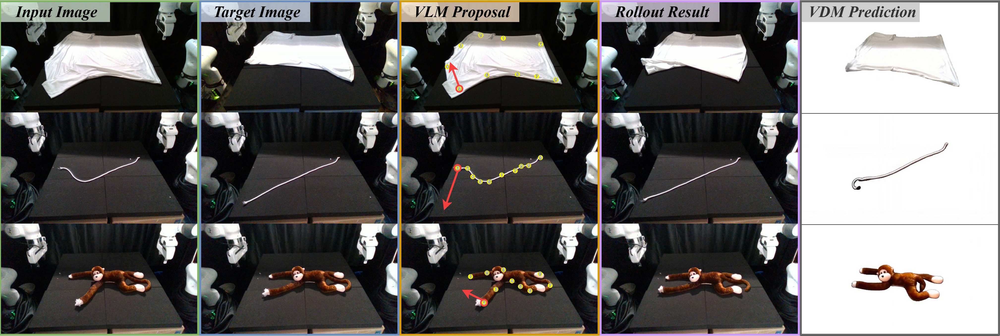

<h1 align="center">DreamPlan: Efficient Reinforcement Fine-Tuning <br/> of Vision-Language Planners via Video World Models</h1>

<p align="center">
  
</p>

<div align="center">

[](https://arxiv.org/abs/2603.16860) [](https://psi-lab.ai/DreamPlan) [](./LICENSE)

</div>

<p align="center">
  <a href="https://emily-jia.github.io/personal-web/">Emily Yue-Ting Jia</a><sup>*1</sup>,
  <a href="https://weiduoyuan.com/">Weiduo Yuan</a><sup>*1</sup>,
  <a href="https://www.linkedin.com/in/tianheng-shi-5244b8201/">Tianheng Shi</a><sup>1</sup>,
  <a href="https://vitorguizilini.github.io/">Vitor Guizilini</a><sup>2</sup>,
  <a href="https://pointscoder.github.io">Jiageng Mao</a><sup>†1</sup>,
  <a href="https://yuewang.xyz">Yue Wang</a><sup>†1</sup>
</p>

<p align="center">
  <sup>1</sup>USC Physical Superintelligence (PSI) Lab &nbsp;&nbsp;
  <sup>2</sup>Toyota Research Institute
</p>

<p align="center"><sup>*</sup>Equal contribution &nbsp; <sup>†</sup>Equal advising</p>

---

## Code is coming soon!

## Citation

```bibtex
@misc{jia2026dreamplanefficientreinforcementfinetuning,
      title={DreamPlan: Efficient Reinforcement Fine-Tuning of Vision-Language Planners via Video World Models}, 
      author={Emily Yue-Ting Jia and Weiduo Yuan and Tianheng Shi and Vitor Guizilini and Jiageng Mao and Yue Wang},
      year={2026},
      eprint={2603.16860},
      archivePrefix={arXiv},
      primaryClass={cs.RO},
      url={https://arxiv.org/abs/2603.16860}, 
}
```

## License

This project is licensed under the Apache 2.0 License - see the [LICENSE](./LICENSE) file for details.

